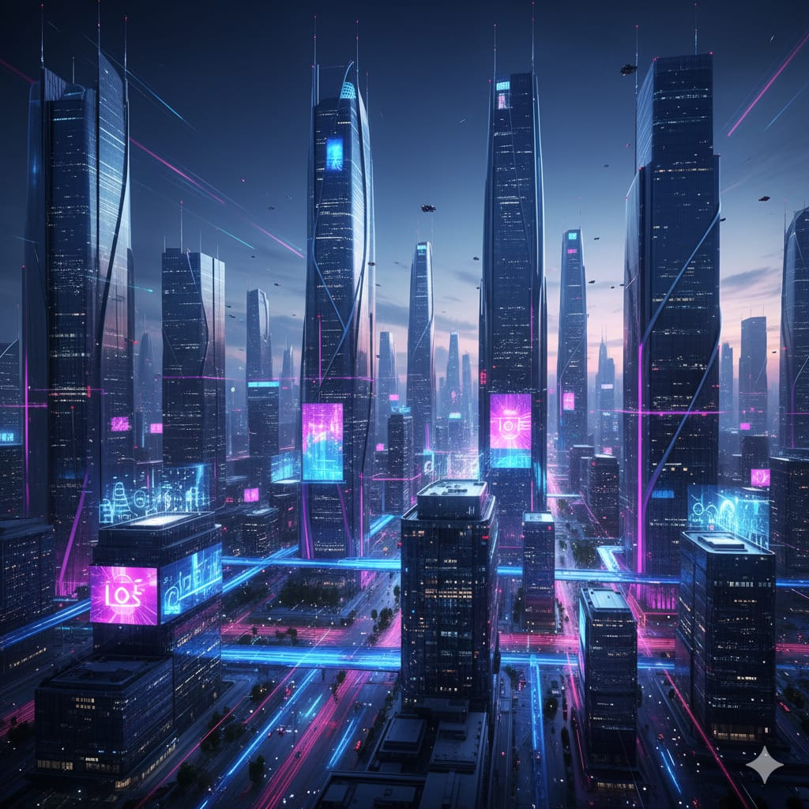

███████╗██╗ ██╗ ██████╗ ██╗ ██╗ █████╗ ███╗ ██╗████████╗██╗ ██╗
██╔════╝██║ ██║██╔═══██╗██║ ██║██╔══██╗████╗ ██║╚══██╔══╝╚██╗ ██╔╝
█████╗ ██║ ██║██║ ██║██║ ██║███████║██╔██╗ ██║ ██║ ╚████╔╝
██╔══╝ ╚██╗ ██╔╝██║ ██║██║ ██║██╔══██║██║╚██╗██║ ██║ ╚██╔╝
███████╗ ╚████╔╝ ╚██████╔╝╚██████╔╝██║ ██║██║ ╚████║ ██║ ██║
╚══════╝ ╚═══╝ ╚═════╝ ╚═════╝ ╚═╝ ╚═╝╚═╝ ╚═══╝ ╚═╝ ╚═╝
🌌 E V O L U Ç Ã O C O M P U T A C I O N A L : Q U A N T U M - A I




---

## 🧠 **Resumo Rápido**

Experiência web imersiva que narra a **evolução da computação**, passando pela era clássica, processadores modernos e o futuro quântico.  
Desenvolvido com **React 19 + Vite**, utilizando **CSS modular e granular** para estilização refinada.  
A galeria e as animações são controladas por **hooks, states e timers**, garantindo fluidez e interatividade.

O módulo **“Quantum City”** é implementado com **Phaser 3**, renderizado dentro do React via *canvas* dedicado.  
Essa cena interativa traz **controles virtuais**, **colisões**, **movimentos dinâmicos** e lógica própria de jogo — simbolizando o salto para a era da computação quântica.

Os **assets multimídia** (vídeos, imagens, trilhas sonoras) são servidos a partir de `public/`, com utilitários que resolvem URLs em tempo de execução.  
Build e lint seguem scripts padrão via **npm**, mantendo o foco em **responsividade, acessibilidade** e compatibilidade entre dispositivos.

---

## ⚙️ **Tecnologias Principais**
- ⚛️ **React 19 + Vite**
- 🎮 **Phaser 3**
- 🎨 **CSS modular e granular**
- 🔉 **Vídeos, imagens e áudio integrados**
- ♿ **Acessibilidade com aria-tags, teclado e touch**

---

## 💡 **Execução Local**
```bash
npm install
npm run dev


Abra no navegador: http://localhost:5173

📦 Build
npm run build


Gera a pasta dist/ pronta para deploy no GitHub Pages ou servidor estático.

✨ Créditos

Criado por Anderson J. Oliveira
📍 São José – SC
🔗 LinkedIn
 | GitHub